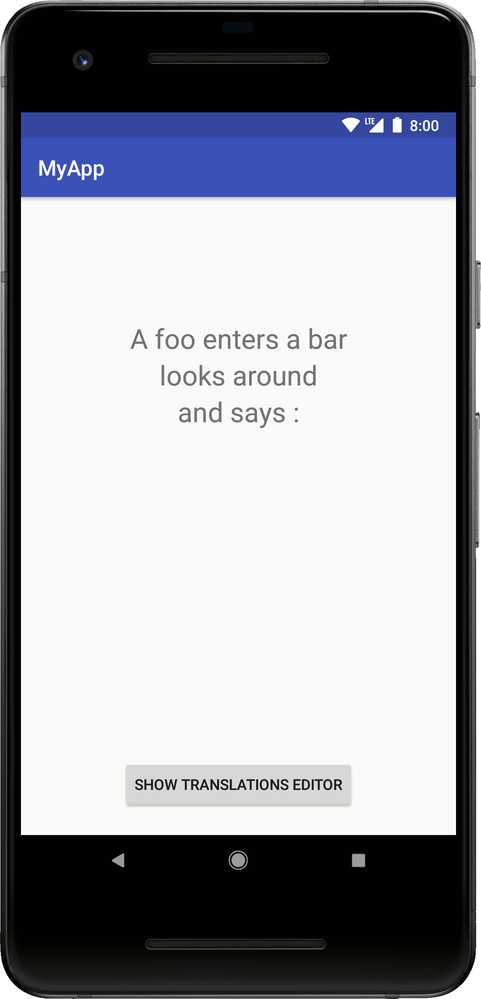
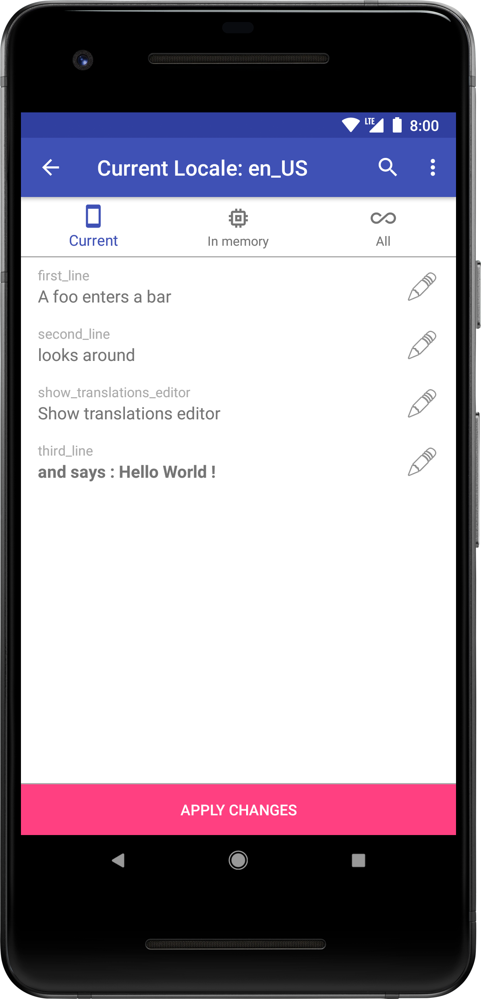

# Kunstmaan Translations Editor

## Features
- [x] Edit your String.xml of specified Locales directly in the application
- [x] Share the modified values (xml or json)
- [x] Custom json and xml format
- [x] Add patterns to be ignored in the translations window (Strings from libraries, ...)
- [x] See the strings in 3 categories :
    - `Current`   : Strings from the current view
    - `In memory` : Strings present in memory
    - `All`       : All Strings of the application


 &nbsp;&nbsp;&nbsp;&nbsp;&nbsp;&nbsp;&nbsp;&nbsp;&nbsp;&nbsp;&nbsp;&nbsp;&nbsp;&nbsp;&nbsp;&nbsp;&nbsp;&nbsp;

Example project integrating this in the Android build process can be found here

## Installation

in the `build.gradle` of your app, put:

```groovy
implementation 'be.kunstmaan.android:kunstmaan-translations-editor:1.0.0'
// implementationDebug if needed only for debugging purposes
```

## Usage

### 1. Build the Kunstmaan Translations Editor

```java
new KunstmaanTranslationUtil.Builder(application, R.string.class.getFields())
                            .build();
```

### 2. Show the Editor 

with `KunstmaanTranslationUtil.showTranslationsWindow();`

In this example we use a button to show the Editor but we recommend the library [KunstmaanShakerMenu](https://github.com/Kunstmaan/KunstmaanShakerMenu) to show the Editor after shaking the phone.

## Customization


### Add additional Locales files to be considered by the Editor

The default file is considered automatically.

- use the same prefix as your additionnal xml file : `new Locale("nl")`

```java
List<Locale> localeList = new ArrayList<>();
localeList.add(new Locale("nl"));
localeList.add(new Locale("de"));


new KunstmaanTranslationUtil.Builder(application, R.string.class.getFields())
			.addLocales(localeList)
			.build();

```


### Add a `Pattern` to be ignored by the Editor

Use a [regex] (https://docs.oracle.com/javase/8/docs/api/java/util/regex/Pattern.html) to specify which keys from strings.xml should be ignored by the Editor.

```java
    .addIgnorePattern(Pattern.compile("regexOfPatternToBeIgnored"))
```

### Set a custom Json format

The default Json format of the shared changes is :

```json
[
  {
    "key": "key_of_string",
    "locale": "localeOfTheString",
    "newValue": "new value",
    "oldValue": "old value"
  }
]
```

you can provide your own format to be used.  
Use this place holders where you want the value to appear :

- `${key}`
- `${locale}`
- `${newValue}`
- `${oldValue}`

```java
.addCustomJsonFormat("{\n" +
                     "  \"myCustomNameForTheKey\": \"${key}\",\n" +
                     "  \"myCustomNameForTheNewValue\": \"${newValue}\",\n" +
                     "}")
```

will give you
```json
[
{
  "myCustomNameForTheKey": "key_of_the_string",
  "myCustomNameForTheNewValue": "new value",
}
]
```

### Set a custom Xml format

The default Xml format of the shared changes is :

```xml
<?xml version='1.0' encoding='UTF-8' standalone='yes' ?>
<Translations>
<translation>
    <locale>locale</locale>
    <key>key_of_the_string</key>
    <oldValue>old value</oldValue>
    <newValue>new value</newValue>
</translation>
</Translations>
```

you can provide your own format.
Use this place holders where you want the value to appear :

- `${key}`
- `${locale}`
- `${newValue}`
- `${oldValue}`

```java
.addCustomXmlFormat("myNewRootTag",
	"<myName>\n" +
	"    <myLocaleTag>${locale}</myLocaleTag>\n" +
	"    <myKeyTag>${key}</myKeyTag>\n" +
	"    <myOldValueTag>${oldValue}</myOldValueTag>\n" +
	"    <myNewValueTag>${newValue}</myNewValueTag>\n" +
	"</myName>")
```

will give 
```xml
<?xml version='1.0' encoding='UTF-8' standalone='yes' ?>
<myNewRootTag>
<myName>
    <myLocaleTag>locale</myLocaleTag>
    <myKeyTag>string_key</myKeyTag>
    <myOldValueTag>old value</myOldValueTag>
    <myNewValueTag>new value</myNewValueTag>
</myName>
</myNewRootTag>
```
